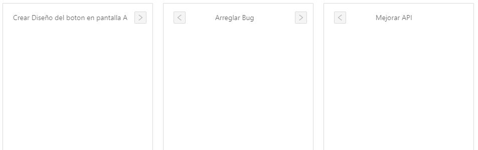

# Tasks-App
### Simple Web App para organizar mejor tus tareas

##### La idea de este proyecto es poder analizar como el entrevistado completaria las tareas propuestas

###### No se pide tanto foco en el diseño, sino en la creación de componentes y en como se comunican con las props y el estado. Tomatelo con calma, cualquier duda que tengas no dudes en preguntar!

La finalidad del proyecto separar las tareas dependiendo de su estado. Sus estados posibles son:
* TODO (todavía no se empezo)
* DOING (se esta desarrollando la tarea)
* DONE (la tarea esta completada)

La App separa las tareas en las tres columnas correspondientes a su estado. Esto es un ejempo de posibles tareas y su organizacion:

| TODO        | DOING           | DONE          |
|:-:|:-:|:-:|
|Crear Pantalla Inicio| arreglar pantalla A | Terminar Login |
|| Arreglar API      | Revisar alineamiento vertical |
||Crear Diseño de Pantalla B  |  |

Para crear nuevas tareas se debe crear: 
1. Un input en el cual se escriba el *nombre* de la tarea a ser realizada.
2. Un botón para crear la nueva tarea

La nueva tarea debera aparecer en la columna de **TODO**.

Una vez creada la tarea, podrá moverla cuantas veces desee el usuario para acomodarla donde corresponda. Para pasar de una columna a la otra, deberá aparecer una flechita al lado del nombre de la tarea. Cuando se clickea la flechita, la tarea pasara a la columna que indica la flecha. Ejemplo: 

## Instalación y Correr el Proyecto

##### Para instalar:
1. **clonar** el repo en tu máquina
2. ejectuar el comando **"npm install"** dentro de la carpeta *tasks_app*

##### Para correr:
1. ejectuar el comando **"npm run start"** dentro de la carpeta *tasks_app*

Si vas a **localhost:3000** en el navegador ya estara el proyecto corriendo para poder empezar.

# Éxitos!

